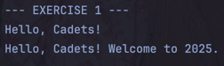

# Exploring Java StringBuilder

## Warren Denzel F. Cheng

## Introduction
This repository contains a Java program that demonstrates the use of the `StringBuilder` class through various exercises.

## Exercises
1. **append() - Appending Content**

  
2. **insert() - Inserting Content at a Position**

  
3. **delete() - Deleting Content**

  
4. **replace() - Replacing a Section**

  
5. **Method Chaining**

  
6. **substring(), indexOf(), and Non-Existing Words**

  
7. **toString() - Converting back to a String**

  
